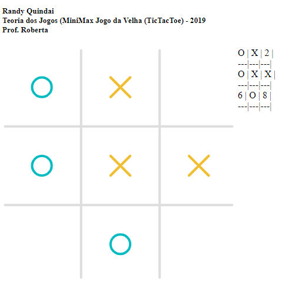

# Jogo da Velha (Tic Tac Toe)
Jogo da velha em javascript usando MiniMax e Heurística da Matriz de ganhos.

Nesse jogo, você empata ou o computador vence, não existe um cenário em que você vence o computador :stuck_out_tongue_winking_eye:. [Jogue aqui](http://quindai.github.io/jogo_da_velha), tente ganhar! :alien:

